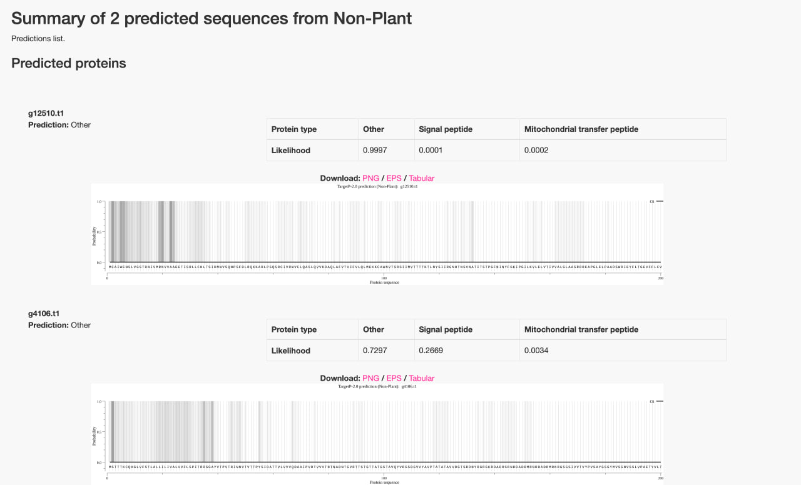

# Project 4. Tardigrades: from genestealers to space marines

## Structural and functional analysis of chromatin-associated proteins in *Ramazzottius varieornatus*

**Student:** Alina Tagirova  

## 1. Data sources

This project is based on genomic and proteomic data for the tardigrade *Ramazzottius varieornatus* (strain YOKOZUNA-1).

The assembled genome sequence of *R. varieornatus* was obtained from the NCBI database in FASTA format and used as a reference. Structural gene annotation was not performed de novo in this project; instead, precomputed gene predictions generated using the AUGUSTUS gene prediction software were used. These predictions included genomic coordinates of genes and transcripts (GFF format) as well as the corresponding predicted protein sequences (FASTA format).

In addition to genomic data, a set of short peptide sequences obtained by tandem mass spectrometry from the chromatin fraction of *R. varieornatus* cells was provided. These peptides represent fragments of proteins experimentally detected in association with DNA and were used to identify candidate chromatin-associated proteins.

The following commands were used to obtain and unpack the genome assembly:
```bash
wget ftp://ftp.ncbi.nlm.nih.gov/genomes/all/GCA/001/949/185/GCA_001949185.1_Rvar_4.0/GCA_001949185.1_Rvar_4.0_genomic.fna.gz
gunzip -k GCA_001949185.1_Rvar_4.0_genomic.fna.gz
```

The files were renamed for clarity and placed into the project data directory:
```bash
mv augustus.whole.aa  Rvar_augustus_proteins.faa
mv augustus.whole.gff Rvar_augustus.gff
```

## 2. Structural annotation and protein prediction

Structural gene annotation of the *Ramazzottius varieornatus* genome was not performed de novo in this project. Instead, precomputed gene predictions generated using the AUGUSTUS gene prediction software were used. The predicted protein sequences were provided in FASTA format and served as the basis for all subsequent analyses.

The total number of predicted protein-coding genes was estimated by counting the number of entries in the protein FASTA file using the following command:

```bash
grep -c '^>' data/raw/Rvar_augustus_proteins.faa
```

This resulted in a total of **16,435 predicted proteins**, which is consistent with the expected gene count for a multicellular eukaryotic organism.

The predicted proteome contains more than sixteen thousand proteins, which is far beyond what can be experimentally validated on an individual basis. Therefore, it is necessary to apply additional filtering strategies to narrow down the list of potential candidates. In this project, candidate selection is achieved by integrating multiple independent lines of evidence, including experimental proteomics data (chromatin-associated peptides), predicted subcellular localization, functional domain annotation, and sequence similarity to known proteins. This stepwise reduction allows prioritization of a small subset of biologically relevant candidates for further experimental validation.

## 3. Physical localization (chromatin fraction) and mapping peptides to proteins

Considering that DNA is a major target of radiation damage, we hypothesized that *Ramazzottius varieornatus* may have proteins physically associated with chromatin that contribute to DNA protection and/or repair. To explore this, genomic predictions were combined with experimental proteomics data.

Chromatin-associated proteins were enriched experimentally by isolating the chromatin fraction, followed by tandem mass spectrometry. This produced a set of short peptide sequences. Each peptide corresponds to a fragment of a protein that was bound to DNA or co-purified during chromatin extraction. The goal of this step was to identify which predicted proteins from the *R. varieornatus* proteome contain these peptides.

### 3.1 Input peptide set

The peptide sequences were provided in FASTA format:

```bash
head -n 10 data/raw/peptides.fa
grep -c '^>' data/raw/peptides.fa
```
A total of 43 peptides were present in the input file.

### 3.2 Local alignment-based search (DIAMOND)

To match short peptides against the predicted proteome, a local alignment-based search was performed using DIAMOND. First, a local database was created from the predicted protein FASTA:
```bash
diamond makedb \
  --in data/raw/Rvar_augustus_proteins.faa \
  --db data/processed/Rvar_proteome
  ```
Then, the peptide sequences were searched against the local proteome database in tabular output format:

```bash
diamond blastp \
  -d data/processed/Rvar_proteome.dmnd \
  -q data/raw/peptides.fa \
  -f 6 qseqid sseqid evalue pident qcovhsp \
  --very-sensitive \
  -o results/peptide_to_protein.tsv
```
### 3.3 Results: peptide-to-protein mapping

The DIAMOND search produced 4 alignments (4 HSPs), corresponding to 4 peptide queries that matched the predicted proteome:
```bash
wc -l results/peptide_to_protein.tsv
head results/peptide_to_protein.tsv
```
To obtain the set of proteins supported by peptide evidence, unique subject protein IDs were extracted:

```bash
cut -f2 results/peptide_to_protein.tsv | sort | uniq | wc -l
cut -f2 results/peptide_to_protein.tsv | sort | uniq
```

In total, **2 predicted proteins** were supported by peptide matches:

- `g4106.t1`
- `g12510.t1`

All reported matches showed **100% sequence identity** and **100% query coverage (qcovhsp = 100)**, with E-values in the range of approximately *1e-6 to 1e-9*, indicating confident and unambiguous mapping of the experimental peptides to the predicted proteins.

These two proteins were therefore selected as **candidate chromatin-associated proteins** and carried forward for downstream subcellular localization prediction and functional annotation.

## 4. Localization prediction

To further prioritize chromatin-associated candidates, subcellular localization was predicted from protein sequences. Two complementary tools were used: WoLF PSORT (general localization prediction for animal proteins) and TargetP 2.0 (prediction of N-terminal targeting peptides and secretory signal peptides). Predictions were performed using the candidate protein FASTA file (`results/chromatin_candidates.faa`).

### 4.1 WoLF PSORT (Animal)

WoLF PSORT was run in **Animal** mode. The results were interpreted primarily to identify **non-secretory proteins** (i.e., proteins not predicted to follow the ER/Golgi/extracellular secretory pathway), which are more plausible candidates for nuclear localization.

- `g4106.t1`: strong secretory-pathway signal (E.R. 14.5; E.R._golg 9.5; extracellular 7; Golgi 3.5), consistent with a protein entering the ER/Golgi pathway.
- `g12510.t1`: predicted mainly as plasma membrane (plas 29; cyto 3) with no evidence for ER/Golgi/extracellular localization.

**Non-secretory candidates (WoLF PSORT):**
- `g12510.t1`

### 4.2 TargetP 2.0 


TargetP 2.0 was run in **Non-plant** mode to evaluate N-terminal presequences: secretory signal peptide (SP) and mitochondrial targeting peptide (mTP). Proteins classified as **Other** (no SP/mTP) were considered compatible with potential nuclear/cytosolic localization.

- `g12510.t1`: Prediction = Other (Likelihood: Other 0.9997; SP 0.0001; mTP 0.0002)
- `g4106.t1`: Prediction = Other (Likelihood: Other 0.7297; SP 0.2669; mTP 0.0034)

### 4.3 Integrated interpretation

Combining both predictors, `g4106.t1` is likely associated with the secretory pathway (WoLF PSORT: ER/Golgi/extracellular), despite being classified as “Other” by TargetP with a moderate SP probability. Therefore, it was excluded from nuclear localization candidates.

`g12510.t1` showed no evidence of secretory or mitochondrial targeting in TargetP and was predicted as non-secretory by WoLF PSORT. It was retained as the primary candidate for downstream functional annotation.

## 5. Pfam domain prediction
Pfam domain prediction with HMMER (hmmscan against the Pfam database) did not yield any significant domain hits for the initially selected candidates (`g4106.t1` and `g12510.t1`). This result is consistent with the possibility that these proteins are highly divergent or lineage-specific.


### Method update: revision of candidate selection strategy

The initial peptide-to-protein mapping performed with DIAMOND produced only a very small number of peptide matches (4 alignments) and resulted in just 2 candidate proteins. Because the peptide queries are short, this approach was considered overly stringent and potentially insensitive.

Therefore, the peptide-to-protein mapping step was repeated using BLAST+ in the `blastp-short` mode, which is specifically designed for short protein queries. A local BLAST database was created from the predicted *R. varieornatus* proteome, and peptide sequences were aligned against it. To reduce false positives, only matches covering the full peptide length (alignment length = query length) and having at least 90% identity were retained. This resulted in a refined candidate list of **20 proteins** supported by peptide evidence.

All subsequent analyses (subcellular localization prediction and functional annotation) were continued using this BLAST-derived candidate set.

```bash
makeblastdb \
  -in data/raw/Rvar_augustus_proteins.faa \
  -dbtype prot \
  -parse_seqids \
  -out /tmp/loc_db
```
Peptide sequences were then aligned against the local proteome database using parameters optimized for short queries:
```bash
blastp -task blastp-short \
  -db /tmp/loc_db \
  -query data/raw/peptides.fa \
  -evalue 1000 \
  -word_size 2 \
  -outfmt "6 qseqid sseqid pident length qlen evalue bitscore" \
  -out results/prot_pept_ext.tsv
```

To reduce false-positive matches, only alignments covering the full peptide length and having high sequence identity were retained. Specifically, matches with full query coverage (alignment length equal to query length) and at least 90% identity were selected:
```bash
awk '$3>=90 && $4==$5 {print $2}' results/prot_pept_ext.tsv | sort -u > results/chromatin_candidates_blast90_ids.txt
wc -l results/chromatin_candidates_blast90_ids.txt
```
The resulting FASTA file containing 20 candidate proteins was used as the input for subsequent localization prediction and functional annotation analyses.


